# `crates/praxis-graphlaw/src/hooks/mod.rs`

Source SHA-256: `c7ca97873cdb59c24025d99f2c0a183865a9de7487b529347847c25fcdc7185d`

```mermaid
classDiagram
    class enum_CmpOp {
      <<enum>>
    }
    class struct_HookId {
      <<struct>>
    }
    class struct_EventId {
      <<struct>>
    }
    class enum_CompiledCondition {
      <<enum>>
    }
    class enum_FeatureDecision {
      <<enum>>
    }
    class enum_ProfileDecision {
      <<enum>>
    }
    class enum_TemplatePart {
      <<enum>>
    }
    class struct_CompiledTripleTemplate {
      <<struct>>
      +"subject: TemplatePart"
      +"predicate: TemplatePart"
      +"object: TemplatePart"
    }
    class struct_CompiledDeltaTemplate {
      <<struct>>
      +"triples: Vec~CompiledTripleTemplate~"
      +"max_binding_slot: usize"
    }
    class struct_CompiledHook {
      <<struct>>
      +"id: HookId"
      +"iri: String"
      +"name: String"
      +"event: EventId"
      +"on: String"
      +"condition: HookCondition"
      +"effect: EffectKind"
      +"action: Option~String~"
      +"reason: Option~String~"
      +"priority: u8"
      +"after: smallvec::SmallVec~[HookId; 4]~"
    }
    class enum_HookCondition {
      <<enum>>
    }
    class enum_EffectKind {
      <<enum>>
    }
    class struct_KnowledgeHook {
      <<struct>>
      +"iri: String"
      +"name: String"
      +"on: String"
      +"condition: HookCondition"
      +"effect: EffectKind"
      +"action: Option~String~"
      +"reason: Option~String~"
      +"priority: u8"
      +"after: Vec~String~"
    }
    class struct_HookPack {
      <<struct>>
      +"name: String"
      +"version: String"
      +"description: String"
      +"required_dialects: Vec~String~"
      +"hooks: Vec~KnowledgeHook~"
    }
    class mod_compile {
      <<mod>>
    }
    class mod_condition {
      <<mod>>
    }
    class mod_construct {
      <<mod>>
    }
    class mod_datalog {
      <<mod>>
    }
    class mod_delta_query {
      <<mod>>
    }
    class mod_evaluate {
      <<mod>>
    }
    class mod_parsing {
      <<mod>>
    }
    class mod_quads {
      <<mod>>
    }
    class mod_toml {
      <<mod>>
    }
    class mod_verdict {
      <<mod>>
    }
    class mod_tests {
      <<mod>>
    }
    note "CmpOp"
    note "CompiledCondition"
```

## Dependencies

- `compile::{compile_hooks, schedule_hooks}`
- `condition::{compile_condition, evaluate_condition}`
- `construct::{evaluate_construct, serialize_delta_quad, HookReceipt}`
- `crate::Parser`
- `crate::TripleStore`
- `crate::encoding::Encoder`
- `crate::fastmap::FxHashMap`
- `crate::term::{Triple, VarOrTerm}`
- `datalog::translate_datalog_to_n3`
- `delta_query::parse_shape_map`
- `evaluate::{evaluate_hooks, ActionOutcome}`
- `parsing::{ clean_term, contains_forbidden_keyword, parse_rdf_integer, validate_and_extract_hooks, }`
- `quads::{ canonicalize_quads, escape_literal, get_where_triple_pattern, parse_construct, serialize_quad, strip_comments, tokenize_triple, ConstructQuery, }`
- `serde::{Deserialize, Serialize}`
- `smallvec::SmallVec`
- `super::*`
- `toml::parse_simple_toml`
- `verdict::{ hook_hash, DiagnosticDetail, GraphDelta, HookError, HookVerdict, HookVerdictRecord, TriggerDiagnostic, }`

## Standing

- Structural parse: `ALIVE`
- Runtime behavior: `UNKNOWN`
