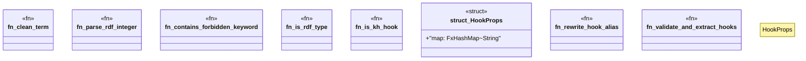

# `crates/praxis-graphlaw/src/hooks/parsing.rs`

Source SHA-256: `7e7a04951c24221c2c3e38c81fc1c7a8d051e4e2905445b8f594db7045850c06`

## Dependencies

- `crate::TripleStore`
- `crate::encoding::Encoder`
- `crate::fastmap::FxHashMap`
- `crate::term::{Triple, VarOrTerm}`
- `serde::{Deserialize, Serialize}`
- `super::quads::parse_construct`
- `super::{ CmpOp, EffectKind, HookCondition, KnowledgeHook, ALLOWED_KH_PREDICATES, HOOK_ALIAS_MAP, HOOK_ALIAS_NS, KH_NS, SHACL_LAW_PACK, }`

## Standing

- Structural parse: `ALIVE`
- Runtime behavior: `UNKNOWN`
