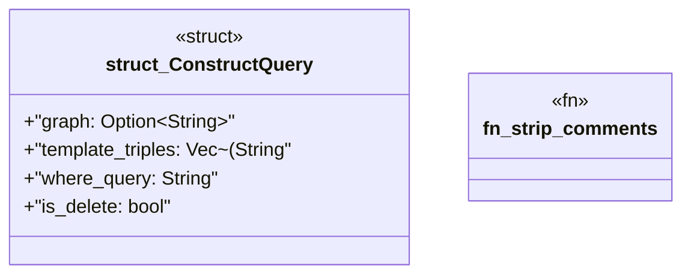

# `crates/praxis-graphlaw/src/hooks/quads.rs`

Source SHA-256: `2942ac8010af25d4253f157339a675fe70eb96d9f4e2f875df272a3a9b3db3c3`

## Dependencies

- `crate::term::Triple`
- `super::strip_comments`

## Standing

- Structural parse: `ALIVE`
- Runtime behavior: `UNKNOWN`
