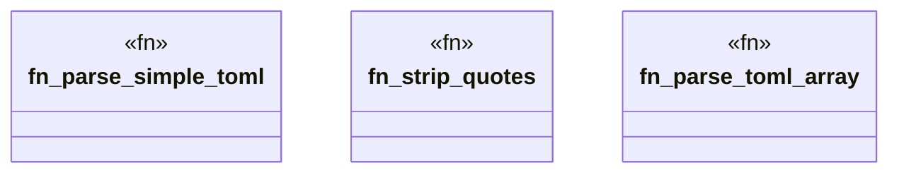

# `crates/praxis-graphlaw/src/hooks/toml.rs`

Source SHA-256: `4e1db36397cd930bc5ec330c2ac7304c97e56473d8d3e8a4aa1f8c8fda24e6fd`

## Dependencies

- None observed.

## Standing

- Structural parse: `ALIVE`
- Runtime behavior: `UNKNOWN`
