# `crates/praxis-graphlaw/src/hooks/verdict.rs`

Source SHA-256: `02eaec44ddf47e3d6b93150646acee393dab6a37c2eb6e978a53e2972fcd9a9e`

```mermaid
classDiagram
    class struct_HookError {
      <<struct>>
      +"detail: String"
    }
    class struct_GraphDelta {
      <<struct>>
      +"additions: Vec~Triple~"
      +"removals: Vec~Triple~"
    }
    class enum_HookVerdict {
      <<enum>>
    }
    class struct_DiagnosticDetail {
      <<struct>>
      +"focus_node: Option~String~"
      +"result_path: Option~String~"
      +"value: Option~String~"
      +"severity: Option~String~"
      +"message: String"
    }
    class struct_TriggerDiagnostic {
      <<struct>>
      +"hook_iri: String"
      +"conforms: bool"
      +"details: Vec~DiagnosticDetail~"
    }
    class struct_HookVerdictRecord {
      <<struct>>
      +"hook_id: HookId"
      +"hook_iri: String"
      +"hook_name: String"
      +"condition_kind: String"
      +"condition_hash: String"
      +"verdict: HookVerdict"
      +"effect: EffectKind"
      +"action_iri: Option~String~"
      +"diagnostics: Option~TriggerDiagnostic~"
      +"delta_hash: Option~String~"
      +"idempotency_key: Option~String~"
    }
    class fn_hook_hash {
      <<fn>>
    }
    note "From~"
    note "From~String~ for HookError"
    note "HookCondition"
    note "HookVerdictRecord"
    note "fmt::Display for HookError"
    note "std::error::Error for HookError"
```

## Dependencies

- `crate::term::Triple`
- `serde::{Deserialize, Serialize}`
- `sha2::{Digest, Sha256}`
- `std::fmt`
- `std::fmt::Write`
- `super::{EffectKind, HookCondition, HookId}`

## Standing

- Structural parse: `ALIVE`
- Runtime behavior: `UNKNOWN`
