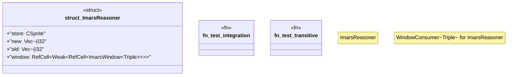

# `crates/praxis-graphlaw/src/imars_reasoner.rs`

Source SHA-256: `525dcaab48884874763d9c2a7b5838cd2ed999da9e90b2b549a64741d987b217`

## Dependencies

- `crate::Parser`
- `crate::Triple`
- `crate::csprite::CSprite`
- `crate::imars_window::{ImarsWindow, WindowConsumer}`
- `std::cell::RefCell`
- `std::rc::{Rc, Weak}`

## Standing

- Structural parse: `ALIVE`
- Runtime behavior: `UNKNOWN`
