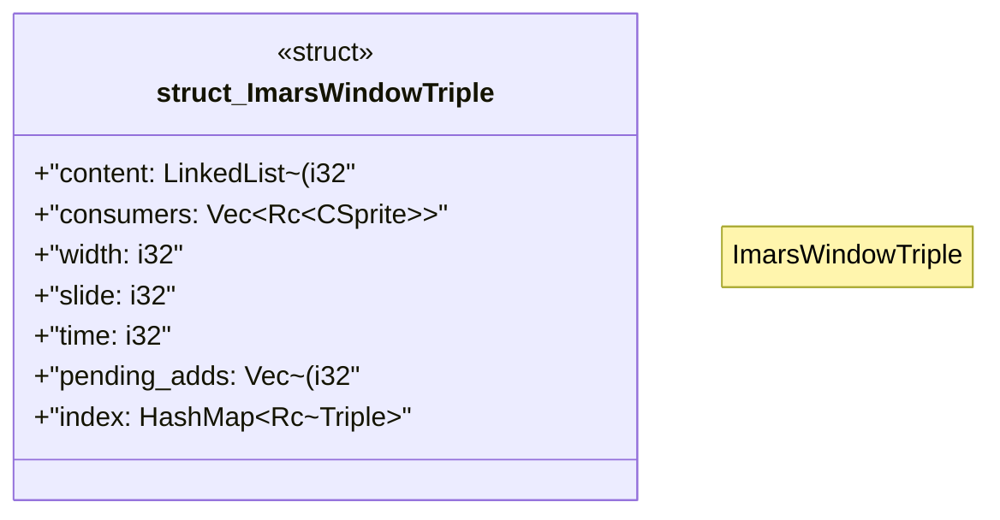

# `crates/praxis-graphlaw/src/imars_triple.rs`

Source SHA-256: `756a40dcb06e4ebe16df89d698ce3436298dd222ea5b038fc2eee265e9df84ad`

## Dependencies

- `crate::Triple`
- `crate::csprite::CSprite`
- `deepmesa::lists::LinkedList`
- `deepmesa::lists::linkedlist::Node`
- `std::cell::RefCell`
- `std::cmp`
- `std::collections::HashMap`
- `std::hash::Hash`
- `std::rc::Rc`

## Standing

- Structural parse: `ALIVE`
- Runtime behavior: `UNKNOWN`
