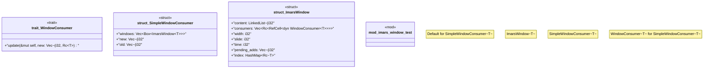

# `crates/praxis-graphlaw/src/imars_window.rs`

Source SHA-256: `413444fb5a9a7ec02dda965a3c94165109c8f2e1e8bb9e0480042ef96af41467`

## Dependencies

- `deepmesa_collections::LinkedList`
- `deepmesa_collections::linkedlist::NodeHandle as Node`
- `std::cell::RefCell`
- `std::cmp`
- `std::collections::HashMap`
- `std::hash::Hash`
- `std::rc::Rc`

## Standing

- Structural parse: `ALIVE`
- Runtime behavior: `UNKNOWN`
