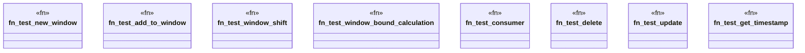

# `crates/praxis-graphlaw/src/imars_window_test.rs`

Source SHA-256: `c7f28948837e80c578fb3b2d8c18e91961f8730ae2ad2e7b3538aab6bc9823e8`

## Dependencies

- `crate::imars_window::{ImarsWindow, SimpleWindowConsumer}`
- `std::cell::RefCell`
- `std::rc::Rc`

## Standing

- Structural parse: `ALIVE`
- Runtime behavior: `UNKNOWN`
