# `crates/praxis-graphlaw/src/lib.rs`

Source SHA-256: `1d59239273e6ce0217d9b99b7e0aecf9a1d4c114efa203b5ea7682090a76a83d`

```mermaid
classDiagram
    class mod_aggregation {
      <<mod>>
    }
    class mod_backwardchaining {
      <<mod>>
    }
    class mod_bindings {
      <<mod>>
    }
    class mod_builtins {
      <<mod>>
    }
    class mod_chatman {
      <<mod>>
    }
    class mod_csprite {
      <<mod>>
    }
    class mod_datalog {
      <<mod>>
    }
    class mod_decode {
      <<mod>>
    }
    class mod_dred {
      <<mod>>
    }
    class mod_encoding {
      <<mod>>
    }
    class mod_fastmap {
      <<mod>>
    }
    class mod_hooks {
      <<mod>>
    }
    class mod_imars_reasoner {
      <<mod>>
    }
    class mod_imars_window {
      <<mod>>
    }
    class mod_observer {
      <<mod>>
    }
    class mod_owlrl {
      <<mod>>
    }
    class mod_oxrdf_adapter {
      <<mod>>
    }
    class mod_parser {
      <<mod>>
    }
    class mod_pipeline {
      <<mod>>
    }
    class mod_queryengine {
      <<mod>>
    }
    class mod_reasoner {
      <<mod>>
    }
    class mod_registry {
      <<mod>>
    }
    class mod_rsp {
      <<mod>>
    }
    class mod_rule {
      <<mod>>
    }
    class mod_ruleindex {
      <<mod>>
    }
    class mod_service_composition {
      <<mod>>
    }
    class mod_shacl {
      <<mod>>
    }
    class mod_shex {
      <<mod>>
    }
    class mod_shex_native {
      <<mod>>
    }
    class mod_shexc_parser {
      <<mod>>
    }
    class mod_sparql {
      <<mod>>
    }
    class mod_term {
      <<mod>>
    }
    class mod_time_window {
      <<mod>>
    }
    class mod_tripleindex {
      <<mod>>
    }
    class mod_triples {
      <<mod>>
    }
    class mod_utils {
      <<mod>>
    }
    class fn_find_unsupported_construct {
      <<fn>>
    }
    class fn_find_unsupported_expression {
      <<fn>>
    }
    class fn_query_pattern {
      <<fn>>
    }
    class fn_plan_query_or_refuse {
      <<fn>>
    }
    class struct_TripleStore {
      <<struct>>
      +"rules: Vec~Rule~"
      +"rules_index: RuleIndex"
      +"triple_index: TripleIndex"
      +"reasoner: Reasoner"
      +"aggregates: HashMap~Rule"
      +"strata: Vec~usize~"
      +"hooks: Vec~hooks::CompiledHook~"
      +"receipts: Vec~hooks::HookReceipt~"
      +"verdicts: Vec~hooks::HookVerdictRecord~"
      +"additions: Vec~Triple~"
      +"removals: Vec~Triple~"
    }
    class fn_preprocess_turtle {
      <<fn>>
    }
    class mod_lib_test {
      <<mod>>
    }
    class mod_parser_edge_cases_test {
      <<mod>>
    }
    note "Default for TripleStore"
    note "TripleStore"
```

## Dependencies

- `crate::backwardchaining::BackwardChainer`
- `crate::bindings::Binding`
- `crate::encoding::Encoder`
- `crate::parser::{Parser, Syntax}`
- `crate::queryengine::{QueryEngine, SimpleQueryEngine}`
- `crate::reasoner::Reasoner`
- `crate::ruleindex::RuleIndex`
- `crate::sparql::{eval_query, evaluate_plan_and_debug}`
- `crate::tripleindex::TripleIndex`
- `crate::triples::{ Aggregate, BlankNodeImpl, BodyLiteral, LiteralImpl, Rule, Term, TermImpl, Triple, VarOrTerm, }`
- `log::trace`
- `spargebra::Query`
- `spargebra::algebra::Expression as E`
- `spargebra::algebra::GraphPattern as G`
- `std::collections::HashMap`
- `std::rc::Rc`

## Standing

- Structural parse: `ALIVE`
- Runtime behavior: `UNKNOWN`
