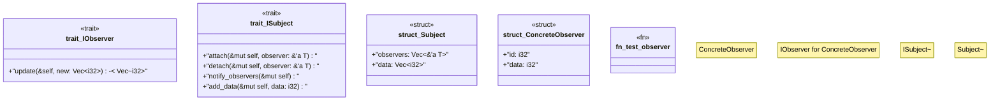

# `crates/praxis-graphlaw/src/observer.rs`

Source SHA-256: `f8f3b2b3ad86c2ae5ef02479a07a7b7b21c542f9c7e7c5480f8af7aca79f18a1`

## Dependencies

- None observed.

## Standing

- Structural parse: `ALIVE`
- Runtime behavior: `UNKNOWN`
