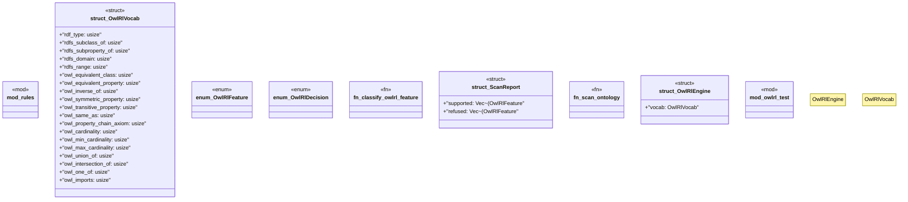

# `crates/praxis-graphlaw/src/owlrl/mod.rs`

Source SHA-256: `a1c021de501aa3dc6e59d1eb62f67086bae4129f7d80a74ee57cf61e1cf0eadb`

## Dependencies

- `crate::TripleStore`
- `crate::encoding::Encoder`
- `crate::term::Triple`
- `crate::term::VarOrTerm`
- `crate::tripleindex::TripleIndex`
- `rules::*`
- `std::sync::Arc`
- `super::*`

## Standing

- Structural parse: `ALIVE`
- Runtime behavior: `UNKNOWN`
