# `crates/praxis-graphlaw/src/owlrl/rules.rs`

Source SHA-256: `8d9a443f8533d84e88cf181d03462d65cfe3b87fe560d7c014af5cf46fbb6f57`

```mermaid
classDiagram
    class fn_dec {
      <<fn>>
    }
    class fn_rule_subclass_transitive {
      <<fn>>
    }
    class fn_rule_subclass_type_propagation {
      <<fn>>
    }
    class fn_rule_subproperty_transitive {
      <<fn>>
    }
    class fn_rule_subproperty_assertion_propagation {
      <<fn>>
    }
    class fn_rule_domain {
      <<fn>>
    }
    class fn_rule_range {
      <<fn>>
    }
    class fn_rules_equivalent_class {
      <<fn>>
    }
    class fn_rules_equivalent_property {
      <<fn>>
    }
    class fn_rule_inverse_of {
      <<fn>>
    }
    class fn_rule_symmetric_property {
      <<fn>>
    }
    class fn_rule_transitive_property {
      <<fn>>
    }
```

## Dependencies

- `crate::encoding::Encoder`
- `crate::rule::{BodyLiteral, Rule}`
- `crate::term::{Triple, VarOrTerm}`
- `super::OwlRlVocab`

## Standing

- Structural parse: `ALIVE`
- Runtime behavior: `UNKNOWN`
