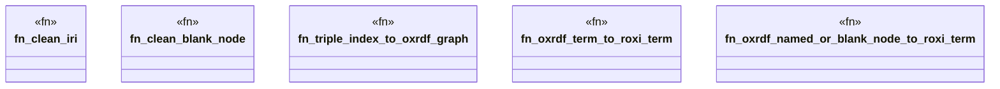

# `crates/praxis-graphlaw/src/oxrdf_adapter.rs`

Source SHA-256: `d39aa37f5fbbadca6d71e872f5aa9ac93fabc770b63f6cf6ad4922502ac38b92`

## Dependencies

- `crate::encoding::Encoder`
- `crate::tripleindex::TripleIndex`
- `crate::triples::Term`
- `oxrdf::{BlankNode, Graph, Literal, NamedNode, NamedOrBlankNode, Term as OxTerm}`

## Standing

- Structural parse: `ALIVE`
- Runtime behavior: `UNKNOWN`
