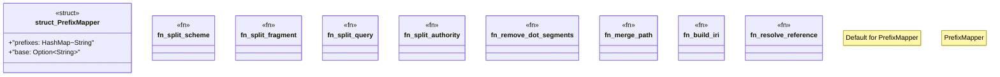

# `crates/praxis-graphlaw/src/parser/iri_resolve.rs`

Source SHA-256: `bf8f685760a09fe0f35e96ea382faa5912b7a783b270b491dd77a3290af166f1`

## Dependencies

- `std::collections::HashMap`

## Standing

- Structural parse: `ALIVE`
- Runtime behavior: `UNKNOWN`
