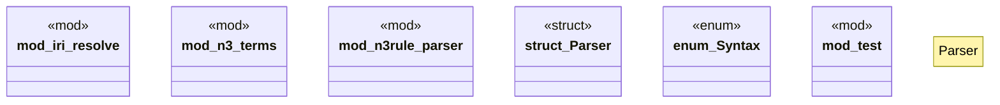

# `crates/praxis-graphlaw/src/parser/mod.rs`

Source SHA-256: `9fc6884ebce1902144f0d0c821cf662c1cec21c939d142051e74771d1b1cd796`

## Dependencies

- `crate::{BodyLiteral, Rule, Triple, VarOrTerm}`
- `rio_api::parser::{QuadsParser, TriplesParser}`
- `rio_turtle::{NQuadsParser, NTriplesParser, TriGParser, TurtleError, TurtleParser}`
- `rio_xml::RdfXmlParser`
- `super::*`

## Standing

- Structural parse: `ALIVE`
- Runtime behavior: `UNKNOWN`
