# `crates/praxis-graphlaw/src/parser/n3_terms.rs`

Source SHA-256: `9fb46fdf558ef7b6807404e08a76be0508764df59145e0084a844e2827853592`

```mermaid
classDiagram
    class fn_make_term {
      <<fn>>
    }
    class fn_parse_literal_pair {
      <<fn>>
    }
    class fn_parse_list {
      <<fn>>
    }
    class fn_fresh_bnode {
      <<fn>>
    }
    class fn_parse_bnode_props {
      <<fn>>
    }
    class fn_parse_predicate_object_list {
      <<fn>>
    }
    class fn_parse_formula {
      <<fn>>
    }
    class fn_bracketed_iri_text {
      <<fn>>
    }
    class fn_term_from_pair {
      <<fn>>
    }
    class fn_fresh_path_bnode {
      <<fn>>
    }
    class fn_parse_path_predicate {
      <<fn>>
    }
    class fn_parse_path_expr {
      <<fn>>
    }
    class fn_unescape_string {
      <<fn>>
    }
    class fn_decode_escapes {
      <<fn>>
    }
    class fn_take_hex_escape {
      <<fn>>
    }
    class fn_expand_property {
      <<fn>>
    }
    class fn_parse_object {
      <<fn>>
    }
```

## Dependencies

- `crate::registry::SYNTHETIC_COUNTER`
- `crate::{Triple, VarOrTerm}`
- `pest::iterators::Pair`
- `std::sync::atomic::Ordering`
- `super::iri_resolve::PrefixMapper`
- `super::n3rule_parser::register_quantifier_declarations`
- `super::n3rule_parser::with_new_scope`
- `super::n3rule_parser::{parse_tp, resolve_var, Rule}`

## Standing

- Structural parse: `ALIVE`
- Runtime behavior: `UNKNOWN`
