# `crates/praxis-graphlaw/src/parser/n3rule_parser.rs`

Source SHA-256: `4ad7a6f6b2b110c72afeb82281aa69e29451acf5ccbc8db5eaf347dcda7b18e4`

```mermaid
classDiagram
    class struct_FormulaScope {
      <<struct>>
      +"forall: HashMap~String"
      +"forsome: HashMap~String"
    }
    class struct_ScopeStack {
      <<struct>>
      +"scopes: Vec~FormulaScope~"
      +"counter: usize"
    }
    class fn_with_new_scope {
      <<fn>>
    }
    class fn_declare_forall_var {
      <<fn>>
    }
    class fn_declare_forsome_var {
      <<fn>>
    }
    class fn_resolve_var {
      <<fn>>
    }
    class fn_register_quantifier_declarations {
      <<fn>>
    }
    class struct_N3Parser {
      <<struct>>
    }
    class fn_parse_tp {
      <<fn>>
    }
    class fn_parse_subject {
      <<fn>>
    }
    class fn_parse_document {
      <<fn>>
    }
    class fn_parse_document_body {
      <<fn>>
    }
    class fn_parse {
      <<fn>>
    }
    class mod_n3rule_parser_test {
      <<mod>>
    }
    note "ScopeStack"
```

## Dependencies

- `crate::registry::SYNTHETIC_COUNTER`
- `crate::{BodyLiteral, Rule as ReasonerRule, Triple, VarOrTerm}`
- `pest::Parser`
- `pest::iterators::{Pair, Pairs}`
- `std::cell::RefCell`
- `std::collections::HashMap`
- `std::sync::atomic::Ordering`
- `super::iri_resolve::PrefixMapper`
- `super::n3_terms`

## Standing

- Structural parse: `ALIVE`
- Runtime behavior: `UNKNOWN`
