# `crates/praxis-graphlaw/src/parser/n3rule_parser_test.rs`

Source SHA-256: `8cb9e40885e98b72d07ace77378af1f83f22db1e430b7c9e994ac1952b0f9573`

```mermaid
classDiagram
    class fn_parse_tp {
      <<fn>>
    }
    class fn_parse_multiple_prefixes {
      <<fn>>
    }
    class fn_parse_multiple_rules {
      <<fn>>
    }
    class fn_parse_multiple_rules_ending_with_dot {
      <<fn>>
    }
    class fn_parse_empty_rule {
      <<fn>>
    }
    class fn_parse_rule_with_multiple_spaces {
      <<fn>>
    }
    class fn_parse_rule_with_a_syntactic_sugar {
      <<fn>>
    }
    class fn_parse_negated_body_literal {
      <<fn>>
    }
    class fn_parse_rule_with_comment {
      <<fn>>
    }
    class fn_parse_multi_head_rule {
      <<fn>>
    }
    class fn_parse_string_literal_in_object {
      <<fn>>
    }
    class fn_parse_blank_node_in_body {
      <<fn>>
    }
```

## Dependencies

- `super::*`

## Standing

- Structural parse: `ALIVE`
- Runtime behavior: `UNKNOWN`
