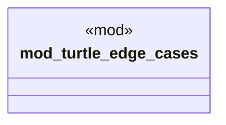

# `crates/praxis-graphlaw/src/parser_edge_cases_test.rs`

Source SHA-256: `8d21cfc9fc347cd5c76f2021b749ba3cc46c5a301e167d3d2691535552548740`

## Dependencies

- `crate::TripleStore`
- `super::*`

## Standing

- Structural parse: `ALIVE`
- Runtime behavior: `UNKNOWN`
