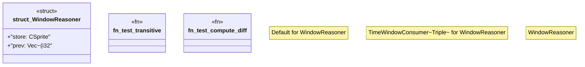

# `crates/praxis-graphlaw/src/pipeline.rs`

Source SHA-256: `63521e4df43d8536b42a73605bbfea66042cf901cf829acb4446c6ec60538ce9`

## Dependencies

- `crate::Parser`
- `crate::Triple`
- `crate::csprite::CSprite`
- `crate::time_window::TimeWindow`
- `crate::time_window::TimeWindowConsumer`
- `std::cell::RefCell`
- `std::rc::Rc`

## Standing

- Structural parse: `ALIVE`
- Runtime behavior: `UNKNOWN`
