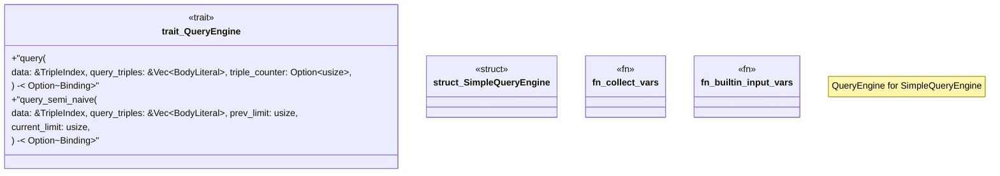

# `crates/praxis-graphlaw/src/queryengine/mod.rs`

Source SHA-256: `f166cd1fdac8eca318b0317beac13f6ce87f369042a8cdfafdc16080a6a02fd0`

## Dependencies

- `crate::builtins`
- `crate::builtins::BuiltinKind`
- `crate::{Binding, BodyLiteral, TripleIndex, VarOrTerm}`

## Standing

- Structural parse: `ALIVE`
- Runtime behavior: `UNKNOWN`
