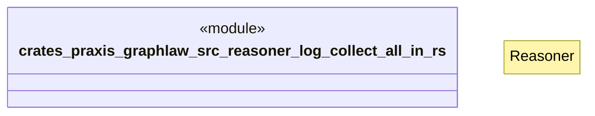

# `crates/praxis-graphlaw/src/reasoner/log_collect_all_in.rs`

Source SHA-256: `6b03192d894796d5fe78aa4afa50cfe133a91d5ac81bd8de52dfb74440afb563`

## Dependencies

- `crate::{ Binding, BodyLiteral, Encoder, QueryEngine, Rule, SimpleQueryEngine, Triple, TripleIndex, VarOrTerm, }`
- `super::Reasoner`

## Standing

- Structural parse: `ALIVE`
- Runtime behavior: `UNKNOWN`
