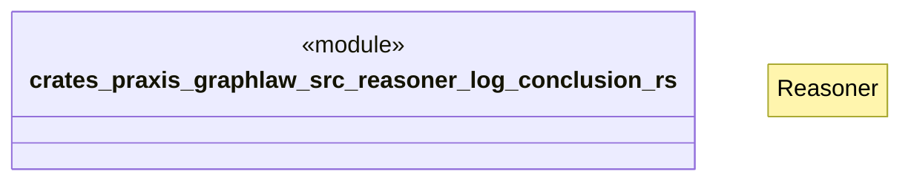

# `crates/praxis-graphlaw/src/reasoner/log_conclusion.rs`

Source SHA-256: `1410848dfae75b910b52af25a0babbaacfc18985a6a43f69d6e8d885f0944d49`

## Dependencies

- `crate::{ Binding, BodyLiteral, Encoder, QueryEngine, Rule, SimpleQueryEngine, Triple, TripleIndex, VarOrTerm, }`
- `super::Reasoner`

## Standing

- Structural parse: `ALIVE`
- Runtime behavior: `UNKNOWN`
