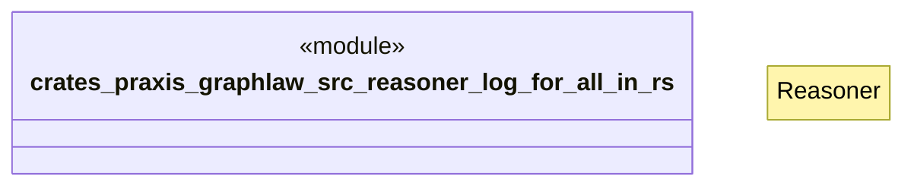

# `crates/praxis-graphlaw/src/reasoner/log_for_all_in.rs`

Source SHA-256: `58aa8c65528a31a3e70131c7b5231f8be9f386f083bbe2b36a1ed4cffbbbb537`

## Dependencies

- `crate::{ Binding, BodyLiteral, Encoder, QueryEngine, Rule, SimpleQueryEngine, Triple, TripleIndex, VarOrTerm, }`
- `super::Reasoner`

## Standing

- Structural parse: `ALIVE`
- Runtime behavior: `UNKNOWN`
