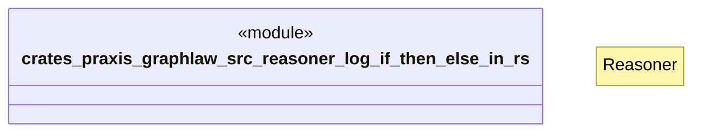

# `crates/praxis-graphlaw/src/reasoner/log_if_then_else_in.rs`

Source SHA-256: `327c517ca62a513ec8db93f10353e358618cf53abf246f5c7908028cae36830c`

## Dependencies

- `crate::{ Binding, BodyLiteral, Encoder, QueryEngine, Rule, SimpleQueryEngine, Triple, TripleIndex, VarOrTerm, }`
- `super::Reasoner`

## Standing

- Structural parse: `ALIVE`
- Runtime behavior: `UNKNOWN`
