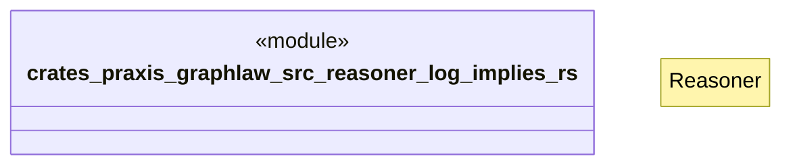

# `crates/praxis-graphlaw/src/reasoner/log_implies.rs`

Source SHA-256: `53f73c09c96a3fa7c67bdab27469f2690317d33394e81f23a6393bfaa440db5a`

## Dependencies

- `crate::{ Binding, BodyLiteral, Encoder, QueryEngine, Rule, SimpleQueryEngine, Triple, TripleIndex, VarOrTerm, }`
- `super::Reasoner`

## Standing

- Structural parse: `ALIVE`
- Runtime behavior: `UNKNOWN`
