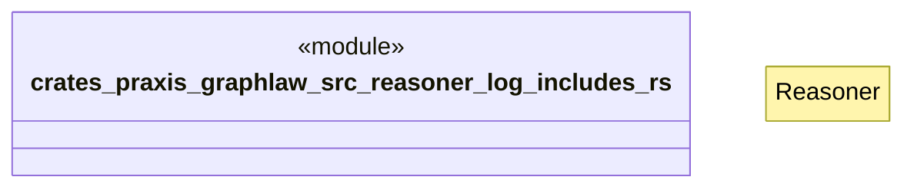

# `crates/praxis-graphlaw/src/reasoner/log_includes.rs`

Source SHA-256: `6a2128e4388f22e05ba372040e247dc816dc268b357f0474b255089bcc05d07d`

## Dependencies

- `crate::{ Binding, BodyLiteral, Encoder, QueryEngine, Rule, SimpleQueryEngine, Triple, TripleIndex, VarOrTerm, }`
- `super::Reasoner`

## Standing

- Structural parse: `ALIVE`
- Runtime behavior: `UNKNOWN`
