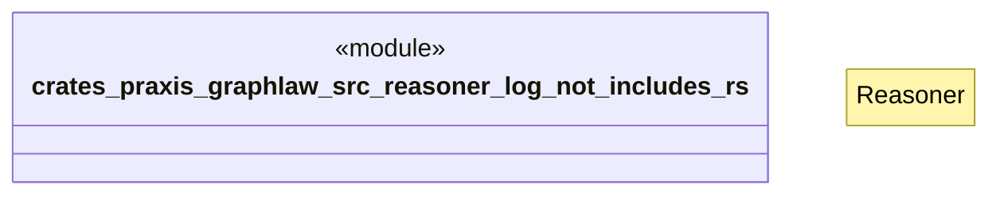

# `crates/praxis-graphlaw/src/reasoner/log_not_includes.rs`

Source SHA-256: `af9fc03fe5b74b2b045d4df565dd5a91897c2e0d3ee675e69ff586c322796149`

## Dependencies

- `crate::{ Binding, BodyLiteral, Encoder, QueryEngine, Rule, SimpleQueryEngine, Triple, TripleIndex, VarOrTerm, }`
- `super::Reasoner`

## Standing

- Structural parse: `ALIVE`
- Runtime behavior: `UNKNOWN`
