# `crates/praxis-graphlaw/src/reasoner/mod.rs`

Source SHA-256: `b8e43d436d926f54d88a7baa8ed420acc8de23828fee145b33a305903ec3e882`

```mermaid
classDiagram
    class mod_log_collect_all_in {
      <<mod>>
    }
    class mod_log_conclusion {
      <<mod>>
    }
    class mod_log_for_all_in {
      <<mod>>
    }
    class mod_log_if_then_else_in {
      <<mod>>
    }
    class mod_log_implies {
      <<mod>>
    }
    class mod_log_includes {
      <<mod>>
    }
    class mod_log_not_includes {
      <<mod>>
    }
    class mod_substitution {
      <<mod>>
    }
    class mod_reasoner_test {
      <<mod>>
    }
    class struct_FactStore {
      <<struct>>
      +"all_facts: FxHashSet~Triple~"
      +"delta: FxHashSet~Triple~"
    }
    class struct_CanonicalDerivation {
      <<struct>>
      +"fact: Triple"
      +"rule_id: usize"
      +"sorted_premises: Vec~Triple~"
      +"round: usize"
    }
    class struct_DerivationGate {
      <<struct>>
      +"derivations: FxHashMap~(Triple"
    }
    class struct_Reasoner {
      <<struct>>
    }
    note "Default for DerivationGate"
    note "Default for FactStore"
    note "DerivationGate"
    note "FactStore"
    note "Reasoner"
```

## Dependencies

- `crate::aggregation::{ Accumulator, AccumulatorImpl, AvgAccumulator, CountAccumulator, MaxAccumulator, MinAccumulator, SumAccumulator, }`
- `crate::builtins::math`
- `crate::fastmap::{FxHashMap, FxHashSet}`
- `crate::hooks::{clean_term, CmpOp, EffectKind, HookCondition}`
- `crate::parser::Parser`
- `crate::queryengine::{QueryEngine, SimpleQueryEngine}`
- `crate::triples::AggregateFunction`
- `crate::{Binding, BodyLiteral, Rule, Triple, TripleIndex, TripleStore, VarOrTerm}`
- `log::debug`
- `std::collections::HashMap`
- `super::*`

## Standing

- Structural parse: `ALIVE`
- Runtime behavior: `UNKNOWN`
