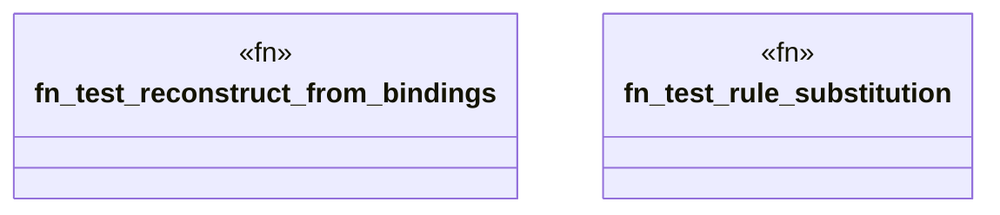

# `crates/praxis-graphlaw/src/reasoner/reasoner_test.rs`

Source SHA-256: `0ed52b7677c38d63bb6c47a8345bb5ae77f837fbf322f197af073a94ea28cf35`

## Dependencies

- `crate::csprite::CSpriteReasoner`
- `crate::reasoner::Reasoner`
- `crate::{Binding, Parser, Triple, VarOrTerm}`

## Standing

- Structural parse: `ALIVE`
- Runtime behavior: `UNKNOWN`
