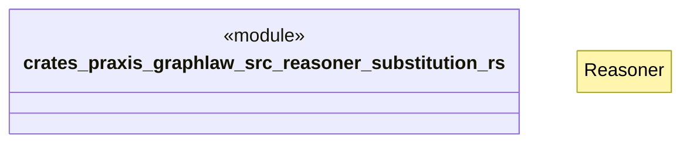

# `crates/praxis-graphlaw/src/reasoner/substitution.rs`

Source SHA-256: `672e696d2b49cc63d14f8b77a8fe02b4dd6e64fa9e37abc830cd06589937859f`

## Dependencies

- `crate::{Binding, BodyLiteral, Rule, Triple, VarOrTerm}`
- `super::Reasoner`

## Standing

- Structural parse: `ALIVE`
- Runtime behavior: `UNKNOWN`
