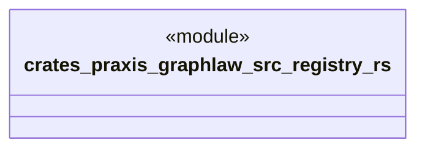

# `crates/praxis-graphlaw/src/registry.rs`

Source SHA-256: `0230dab157b39f6726158319ef9f24808eb024bc5bd37c8cb6973ca0b8f7f69a`

## Dependencies

- `crate::fastmap::FxHashMap`
- `crate::term::{Triple, VarOrTerm}`
- `once_cell::sync::Lazy`
- `std::sync::Mutex`
- `std::sync::atomic::AtomicUsize`

## Standing

- Structural parse: `ALIVE`
- Runtime behavior: `UNKNOWN`
