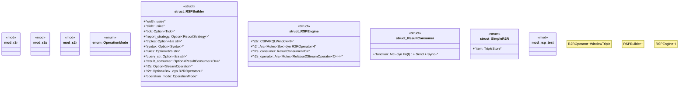

# `crates/praxis-graphlaw/src/rsp.rs`

Source SHA-256: `a56799d78f4a8ccd905df8b3376ecf5a580578faf69175718bf2b02846018a4f`

## Dependencies

- `crate::rsp::r2r::R2ROperator`
- `crate::rsp::r2s::{Relation2StreamOperator, StreamOperator}`
- `crate::rsp::s2r::{ CSPARQLWindow, ContentContainer, Report, ReportStrategy, Tick, WindowTriple, }`
- `crate::sparql::{evaluate_plan_and_debug, Binding}`
- `crate::{Encoder, Syntax, Triple, TripleStore}`
- `log::{debug, error}`
- `spargebra::Query`
- `std::fmt::Debug`
- `std::hash::Hash`
- `std::sync::mpsc::Receiver`
- `std::sync::{Arc, Mutex}`
- `std::thread`

## Standing

- Structural parse: `ALIVE`
- Runtime behavior: `UNKNOWN`
