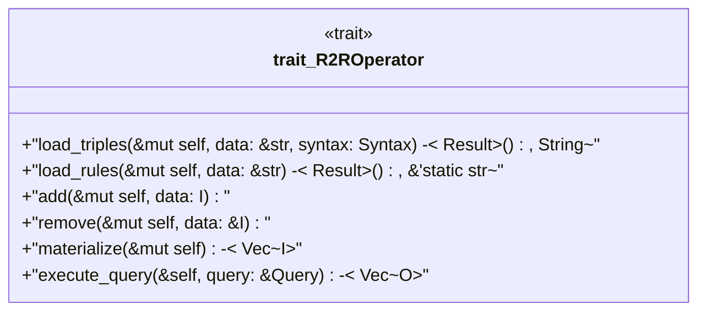

# `crates/praxis-graphlaw/src/rsp/r2r.rs`

Source SHA-256: `64f8e96415c9e8775ce2becc6e61a6c97cbf614d5c23715907a0199a878c3dde`

## Dependencies

- `crate::Syntax`
- `spargebra::Query`

## Standing

- Structural parse: `ALIVE`
- Runtime behavior: `UNKNOWN`
