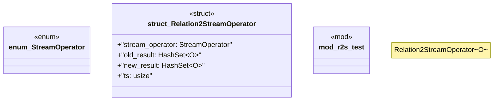

# `crates/praxis-graphlaw/src/rsp/r2s.rs`

Source SHA-256: `daba9461b64d06bd42772e032f49bdfd8533718f0ed66552bf3e911aa4c98304`

## Dependencies

- `std::collections::HashSet`
- `std::hash::Hash`
- `std::mem`

## Standing

- Structural parse: `ALIVE`
- Runtime behavior: `UNKNOWN`
