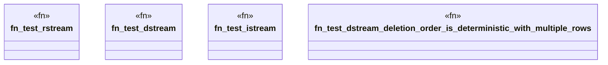

# `crates/praxis-graphlaw/src/rsp/r2s_test.rs`

Source SHA-256: `fd28fc8ac5d3d38e0ab70248d76999f1cdbaa522643c673abf27267111b65cc1`

## Dependencies

- `crate::rsp::r2s::Relation2StreamOperator`
- `crate::rsp::r2s::StreamOperator::{DSTREAM, ISTREAM, RSTREAM}`
- `crate::sparql::Binding`

## Standing

- Structural parse: `ALIVE`
- Runtime behavior: `UNKNOWN`
