# `crates/praxis-graphlaw/src/rsp/s2r.rs`

Source SHA-256: `ebeb3cebe9c3e84a2122fa29c754f9978e5ae431c43ad228830e8c129d46fbd7`

```mermaid
classDiagram
    class enum_ReportStrategy {
      <<enum>>
    }
    class enum_Tick {
      <<enum>>
    }
    class struct_Report {
      <<struct>>
      +"strategies: Vec~ReportStrategy~"
      +"last_change: ContentContainer~I~"
    }
    class struct_Window {
      <<struct>>
      +"open: usize"
      +"close: usize"
    }
    class struct_ContentContainer {
      <<struct>>
      +"elements: HashSet~I~"
      +"last_timestamp_changed: usize"
    }
    class struct_CSPARQLWindow {
      <<struct>>
      +"width: usize"
      +"slide: usize"
      +"t_0: usize"
      +"active_windows: HashMap~Window"
      +"report: Report~I~"
      +"tick: Tick"
      +"app_time: usize"
      +"consumer: Option~Sender~ContentContainer~I~~~"
      +"call_back: Option~Box~dyn FnMut(ContentContainer~I~)~~"
    }
    class struct_ConsumerInner {
      <<struct>>
      +"data: Mutex~Vec~ContentContainer~I~~~"
    }
    class struct_Consumer {
      <<struct>>
      +"inner: Arc~ConsumerInner~I~~"
    }
    class struct_WindowTriple {
      <<struct>>
      +"s: String"
      +"p: String"
      +"o: String"
    }
    class mod_s2r_test {
      <<mod>>
    }
    note "CSPARQLWindow~I~"
    note "Consumer~I~"
    note "ContentContainer~I~"
    note "Default for Report~I~"
    note "Report~I~"
```

## Dependencies

- `log::debug`
- `std::collections::hash_set::{IntoIter, Iter}`
- `std::collections::{HashMap, HashSet}`
- `std::fmt::Debug`
- `std::hash::Hash`
- `std::sync::mpsc::Receiver`
- `std::sync::mpsc::{channel, Sender}`
- `std::sync::{Arc, Mutex}`
- `std::thread`
- `std::{f64, mem}`

## Standing

- Structural parse: `ALIVE`
- Runtime behavior: `UNKNOWN`
