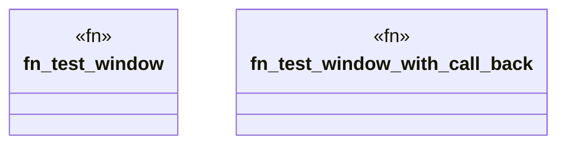

# `crates/praxis-graphlaw/src/rsp/s2r_test.rs`

Source SHA-256: `17f7d99f3d7a2ecc8e70b9ae12a07ec777f04e9bd96665d6a0e4aaf5eb88571b`

## Dependencies

- `std::cell::RefCell`
- `std::rc::Rc`
- `std::time::Duration`
- `super::*`

## Standing

- Structural parse: `ALIVE`
- Runtime behavior: `UNKNOWN`
