# `crates/praxis-graphlaw/src/rsp_test.rs`

Source SHA-256: `2117a7bfd876d4a48009dba01d97aca54b057445dd2de2445a6cdbcc7b815fd9`

```mermaid
classDiagram
    class fn_rsp_integration {
      <<fn>>
    }
    class fn_test_load_from_file {
      <<fn>>
    }
    class fn_rsp_transitive_testp {
      <<fn>>
    }
    class fn_test_static_abox {
      <<fn>>
    }
    class fn_evaluate_r2r_and_call_r2s_skips_the_tick_on_a_poisoned_consumer_lock {
      <<fn>>
    }
    class fn_evaluate_r2r_and_call_r2s_skips_the_tick_on_a_poisoned_r2s_operator_lock {
      <<fn>>
    }
    class fn_build_refuses_with_typed_error_when_query_is_missing {
      <<fn>>
    }
    class fn_build_refuses_with_typed_error_when_r2r_is_missing {
      <<fn>>
    }
```

## Dependencies

- `std::fs::{File, OpenOptions}`
- `std::io`
- `std::io::{BufRead, Write}`
- `std::time::Duration`
- `super::*`

## Standing

- Structural parse: `ALIVE`
- Runtime behavior: `UNKNOWN`
