# `crates/praxis-graphlaw/src/rule.rs`

Source SHA-256: `2fea9c1314c3e61ca0483146d64a355c01c47ab309730d97ad33068eecbf8dc8`

```mermaid
classDiagram
    class struct_BodyLiteral {
      <<struct>>
      +"negated: bool"
      +"pattern: Triple"
    }
    class enum_AggregateFunction {
      <<enum>>
    }
    class struct_Aggregate {
      <<struct>>
      +"function: AggregateFunction"
      +"source_var: String"
      +"target_var: String"
      +"group_vars: Vec~String~"
    }
    class struct_Rule {
      <<struct>>
      +"body: Vec~BodyLiteral~"
      +"head: Triple"
    }
    class enum_Selectivity {
      <<enum>>
    }
    class struct_PatternStep {
      <<struct>>
      +"pattern: Triple"
      +"negated: bool"
      +"selectivity: Selectivity"
      +"new_vars: FxHashSet~usize~"
    }
    class struct_CompiledRule {
      <<struct>>
      +"original_rule: Rc~Rule~"
      +"head: Triple"
      +"body: Vec~PatternStep~"
      +"driving_atom: usize"
    }
    class fn_extract_pattern_vars {
      <<fn>>
    }
    class fn_classify_pattern_selectivity {
      <<fn>>
    }
    class fn_order_body_patterns {
      <<fn>>
    }
    class mod_tests {
      <<mod>>
    }
    note "CompiledRule"
    note "Rule"
    note "Selectivity"
```

## Dependencies

- `crate::Encoder`
- `crate::fastmap::FxHashSet`
- `crate::term::{Triple, VarOrTerm}`
- `std::rc::Rc`
- `super::*`

## Standing

- Structural parse: `ALIVE`
- Runtime behavior: `UNKNOWN`
