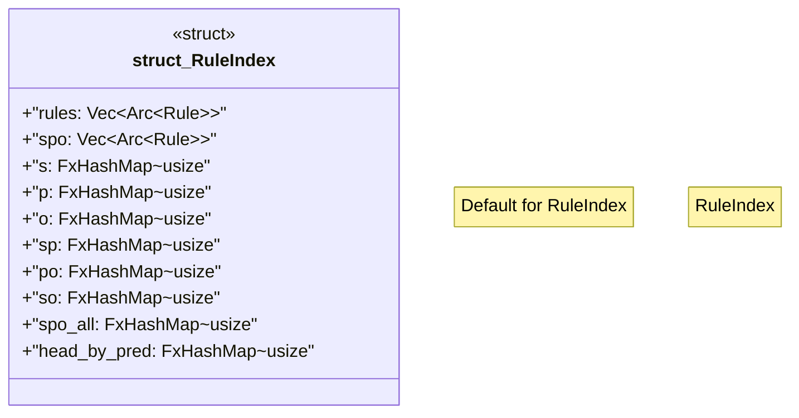

# `crates/praxis-graphlaw/src/ruleindex.rs`

Source SHA-256: `b0773a82d5ed6f21f3ed7b1f089a867d0cc217a9a3238a365a5c7aeadc4e1cdc`

## Dependencies

- `crate::fastmap::FxHashMap`
- `crate::{Rule, Triple}`
- `std::sync::Arc`

## Standing

- Structural parse: `ALIVE`
- Runtime behavior: `UNKNOWN`
