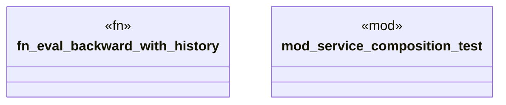

# `crates/praxis-graphlaw/src/service_composition.rs`

Source SHA-256: `139e2ed554a90a438c93389ee07a200e3b0aa2519da8d5fd54379593f4d6edae`

## Dependencies

- `crate::bindings::Binding`
- `crate::reasoner::Reasoner`
- `crate::{BackwardChainer, Rule, RuleIndex, Triple, TripleIndex, TripleStore}`
- `log::debug`
- `std::sync::Arc`

## Standing

- Structural parse: `ALIVE`
- Runtime behavior: `UNKNOWN`
