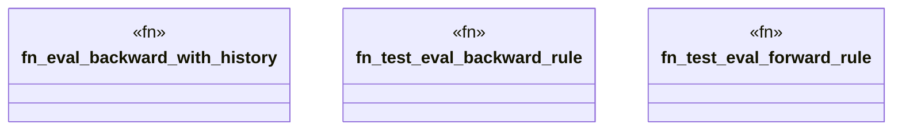

# `crates/praxis-graphlaw/src/service_composition_test.rs`

Source SHA-256: `d7ce8c01aaf5a802102154ecd64f542e793d533ae0c8d4a1dc5762d28e4c6bf8`

## Dependencies

- `crate::bindings::Binding`
- `crate::reasoner::Reasoner`
- `crate::{ BackwardChainer, Encoder, Rule, RuleIndex, Triple, TripleIndex, TripleStore, VarOrTerm, }`
- `log::debug`
- `std::collections::HashMap`
- `std::sync::Arc`

## Standing

- Structural parse: `ALIVE`
- Runtime behavior: `UNKNOWN`
