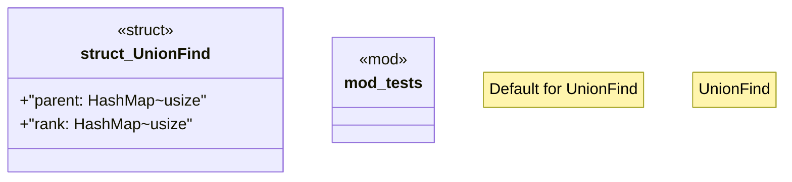

# `crates/praxis-graphlaw/src/shacl/canonicalization.rs`

Source SHA-256: `6a570a3f456b2eb27154bde0cec840698cc87cb68a0c465179f367187993c369`

## Dependencies

- `std::collections::HashMap`
- `super::*`

## Standing

- Structural parse: `ALIVE`
- Runtime behavior: `UNKNOWN`
