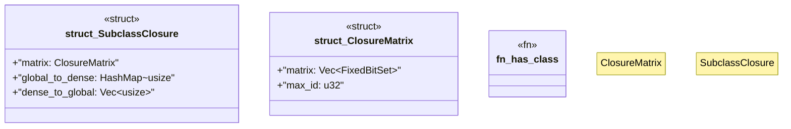

# `crates/praxis-graphlaw/src/shacl/closure.rs`

Source SHA-256: `2ae945970024bfa029d7a212914cb912ba83bfc7b292097cc257e82b23a531f5`

## Dependencies

- `crate::tripleindex::TripleIndex`
- `fixedbitset::FixedBitSet`
- `std::collections::HashMap`
- `super::index_utils::get_triples_by_predicate`

## Standing

- Structural parse: `ALIVE`
- Runtime behavior: `UNKNOWN`
