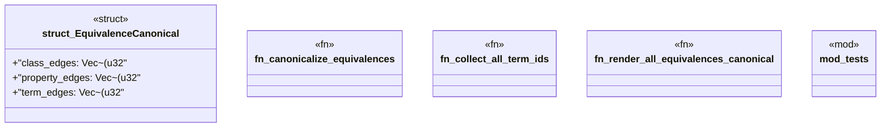

# `crates/praxis-graphlaw/src/shacl/equivalence.rs`

Source SHA-256: `c1c59e0ca22e2cc86f1c8b2ceef5400bc15b809d635366a3ac98da6dd7939203`

## Dependencies

- `crate::tripleindex::TripleIndex`
- `super::*`
- `super::Vocab`
- `super::canonicalization::UnionFind`
- `super::index_utils::get_triples_by_predicate`

## Standing

- Structural parse: `ALIVE`
- Runtime behavior: `UNKNOWN`
