# `crates/praxis-graphlaw/src/shacl/index_utils.rs`

Source SHA-256: `ba7692cb7164bce4ed9bfa198588ae3994f9b8cfe5bf4b360bb49ae1ef1fe0aa`

```mermaid
classDiagram
    class enum_XsdDatatypeOpcode {
      <<enum>>
    }
    class fn_is_shape_deactivated {
      <<fn>>
    }
    class fn_is_blank_node {
      <<fn>>
    }
    class fn_is_iri {
      <<fn>>
    }
    class fn_is_literal {
      <<fn>>
    }
    class fn_get_objects {
      <<fn>>
    }
    class fn_get_subjects {
      <<fn>>
    }
    class fn_get_triples_by_predicate {
      <<fn>>
    }
    class fn_get_rdf_list {
      <<fn>>
    }
    class fn_get_datatype {
      <<fn>>
    }
    class fn_is_lexically_valid_for_datatype {
      <<fn>>
    }
    class fn_check_datatype {
      <<fn>>
    }
    note "XsdDatatypeOpcode"
```

## Dependencies

- `crate::encoding::Encoder`
- `crate::tripleindex::TripleIndex`
- `crate::triples::Term`
- `std::collections::HashSet`
- `super::Vocab`

## Standing

- Structural parse: `ALIVE`
- Runtime behavior: `UNKNOWN`
