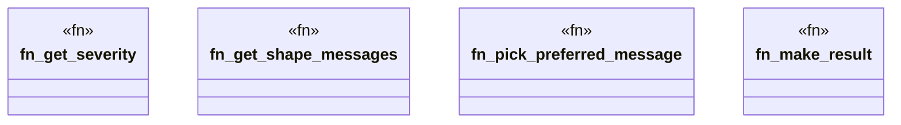

# `crates/praxis-graphlaw/src/shacl/messages.rs`

Source SHA-256: `63e6a7730a1b7d9fd375ba89959baaa9b34883b29c5f2322054513cb8cd919ee`

## Dependencies

- `crate::tripleindex::TripleIndex`
- `super::Vocab`
- `super::index_utils::get_objects`
- `super::report::ValidationResult`
- `super::values::{get_lang_tag, get_lexical_form}`

## Standing

- Structural parse: `ALIVE`
- Runtime behavior: `UNKNOWN`
