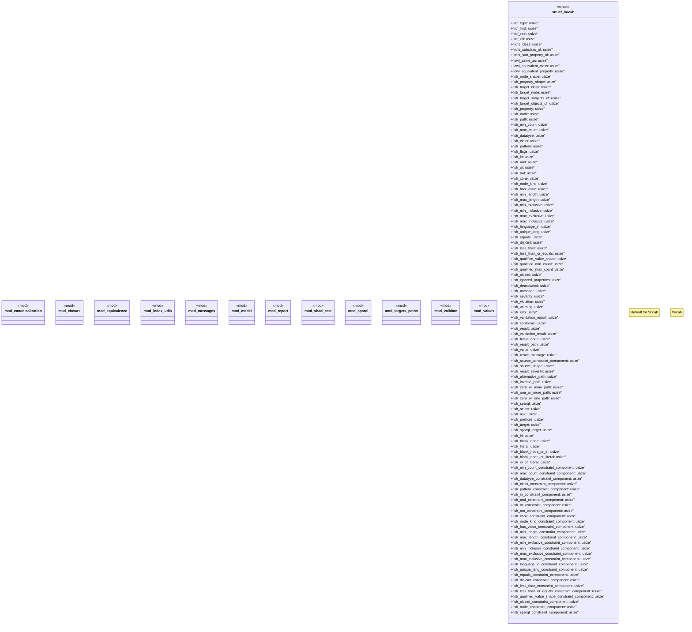

# `crates/praxis-graphlaw/src/shacl/mod.rs`

Source SHA-256: `3b27e8f981976747452bfaae515a21fe71a173e1599bf505726e487a5c1fb0c4`

## Dependencies

- `canonicalization::UnionFind`
- `closure::{ClosureMatrix, SubclassClosure}`
- `crate::encoding::Encoder`
- `equivalence::{ canonicalize_equivalences, render_all_equivalences_canonical, EquivalenceCanonical, }`
- `index_utils::{ get_datatype, get_objects, is_blank_node, is_iri, is_lexically_valid_for_datatype, is_literal, }`
- `model::{ CompiledConstraint, CompiledShape, CompiledTarget, CostClass, PropertyMask, ShapesGraph, TargetType, SHACL_SPARQL_BOUNDARY, }`
- `report::{ValidationReport, ValidationResult, Validator}`
- `values::{compare_numeric, decode_to_term, get_lang_tag, get_lexical_form, match_regex}`

## Standing

- Structural parse: `ALIVE`
- Runtime behavior: `UNKNOWN`
